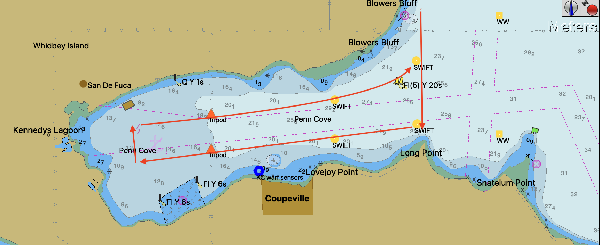

# December recon trip and some initial plots
### A brief report for the M2O2 meeting on Dec 12, 2025

## Overarching cruise report 

As you all know, Jim, Tia, Amy, and I went out on a short(ish) data sampling day tip in Penn Cove last Thursday, December 4th. Our overarching goals for this "recon trip" was to gain some initial insights and physical understanding of Penn Cove to better prepare for the larger 6-month deployment that will begin this spring. In particular, we are interested in these initial questions:
1. Is there north-south asymmetry in velocity at different tidal stages on the "fence" of Penn Cove, which is the line we have drawn from Blowers Bluff (north) to Long Point (south) that we believe defines the entrance to the inlet.
2. Is there density stratification in Penn Cove? If so, when and what does this look like?
3. Are there differences in flow at the top and bottom of the water column, particularly on this fence?
4. Can we gain any initial insights about DO levels in Penn Cove?

Before I get into addressing some of those questions, I first want to walk through what we did and how the day unfolded. Huge thanks to Jim and Amy for getting the boat, the R/V Echo, to the Port of Everett (POE) on Tuesday!

We wanted to catch as many different tidal stages as we could in a reasonable working timeframe, so we left POE at 05:20 and arrived at Penn Cove at 06:30. From here, we deployed the first swift at the southern swift mooring site and took a CTD cast with the Castaway before moving on to deploy the second swift at the northern site. Once that was deployed we took antother Castaway cast there.

By 07:55 we had started our first transect through around Penn Cove. We started at the north end of the fence at Blower's Bluff, transected south across the fence and then turned into Penn Cove at the south end of the fence at 08:10. Here is a map of our transect path: 

At this point in time the tide was still in its weak ebb. 

As we were transecting, we were taking continuous pole-mounted ADCP and CT readings. These instruments were on all day. We were also taking continual CTD casts with the RBR Concerto that measured conductivity, temperature, depth, and DO. Throughout the entire day we took over 500 casts!

At 10:20 we had finished the transect throuhout the bay. At this point, we had sampled through the end of the ebb, through the low at 10:00, and were in the slack tide. We drove out to the planned northern wire walker site and took two Niskin samples at 1 meter and two at 15 meters below the surface. We then fixed these water samples for DO titration (no bubbles!) We then started our second transect through Penn Cove at 11:45 heading south across the fence from Blower's Bluff. We finished this transect back at the northern wire walker site at 14:22 and took a CTD cast with the Concerto at the wire walker site. In second transect we had captured the flood tide and were in the slack tide at this point befor the high at 15:04. 

At 14:37 we began our third and final transect through Penn Cove. Anecdotally, as the tide was at the high/slack and as it began to flood back into the inlet we saw an increase in small fronts and could see some potential internal wave structures propogate into the bay. I did not think to take a picture of this, sorry about that. On this thrid transect we took Niskin samples at the back of the bay near the shellfish farm pens. We too two samples at 1 meter and two at 15 meters. Once we fixed them we noticed the DO samples were a very different color than the ones from out near the wire walker-- some primary indications of low DO perhaps?

We finished the third transect at 17:45 and got head out to POE. In this thrid transect we caught the high, slack, and the large ebb of the day.
We had several engine alarms go off indicating that the port side engine was overheating, so we took it slow and had a gripping ride back.

Jim and I went out the next day to recover the SWIFTs and ran into more engine troubles. We can go into it more in our meeting but suffice it to say the boat is currently in for maintenance. 

## Some initial data 

Going back to some of those overarching questions, I made some additional plots to the ones Jim and Tia shared in the Slack channel.

First, I wanted to understand how water is entering Penn Cove at different tidal stages, and how this differs across the "fence." This gets at the questions:
1. Is there north-south asymmetry in velocity at different tidal stages on the "fence" of Penn Cove? 
2. Are there differences in flow at the top and bottom of the water column, particularly on this fence?
  
Below, we have a timeseries of the data from the Signatures that were mounted on both SWIFTS. The Signatures sampled every 12 minutes for ____ seconds. Please note that this data is still in the preliminary processing stage. Any thoughts that you all have would be awesome! I have not had much time to really get into this data yet.

The sea surface height predictions are from NOAA's tide data, and I had to use the Everett gauge as it was the closest one with minute-by-minute harmoic data. The red colors are eastward velocities and the blue colors are westward velocities.

Similar to Dakota's model, we can see that there are times of a defined two-layer structure in flow at both sites. From a very general scale, we can see that the structures are similar between the SWIFTS. What is really interesting to me is that at the strongest velocities occur at lowest and highest tides of the day, 06:00 and 12:00 GMT (which is 22:00 and 04:00 PST). At the low at 06:00 the northern fence site's velocity profile is clearly dominated by eastward velocities all the way up to 5 meters below the surface. However at the southern fence site, the westward velocities prevail deeper to about 10 meters into the water column. This could potentially indiacte that this southern site is more well-mixed so there is less stratification to interput velocity direction. Or maybe this is just how it propogates into the bay at low water. Another interesting aspect is that on the max flood at both the swifts there is uniform water column that flows westward into the bay. This pattern does not fully appear on the max ebb a few hours before, however. A lot of the water column moves as one, but not all of it. Could some be getting entrained in the bay? Maybe a plume of Skagit water came in and forced movement on the surface?
There is lots to dig into here, I am excited to hear your thoughts on this one.

Another similar figure is below where I plot the average surface u velocity (top 5 meters of the water column, east/west) from each SWIFT over the deployment. Alex and I talked about this figure and thought it might be interesting to see if the lines are "in phase" or "out of phase." In other words, is there a north-south asymmetry in the flow across this fence? Or do the SWIFTS experience the same direction and magnitude of flow at the same time? 

It seems like the answer to the asymmetry question is the classic "sometimes, but not usually." They tend to follow the same velocity directions at the surface, but the times of opposing signals come around 01:00, 06:00, and 

