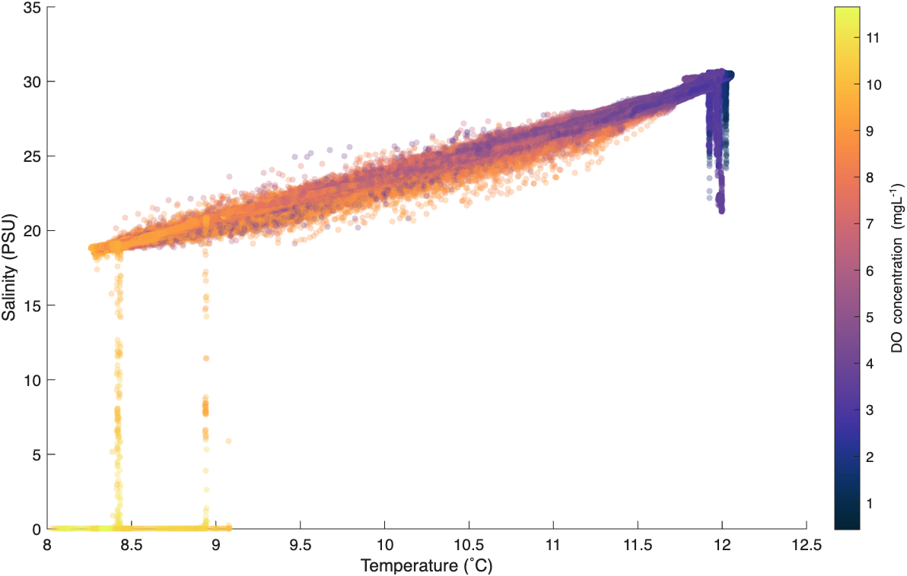
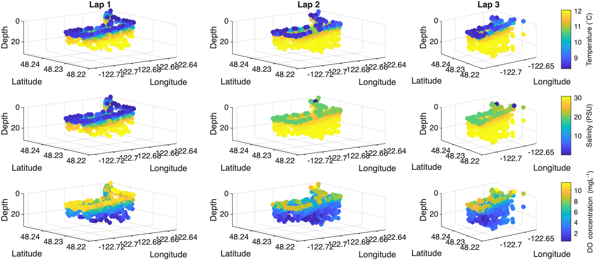

# Weeky update on plots, progress, and mooring design (oh my!)

This past week has been full of starting some more quality control and making a new round of plots! Also Jim and I have been discussing changes to the mooring design. I will walk through the details of all this below.

### Quality control

The big thing I am taking on this week is visually checking the tow-yo CTD data for erroneous or weird-looking data points, especially at the surface and bottom, and looking at the SWIFT Signature1000 data for any occurences of bad averaging for the burst ensembles. 
So far I am just openeing all of this and digging into it so there is not much to report there. I am hesitant to show any plots of more data before having finished this QC, so I am hoping that I will have more by next week! 

### Writing

I threw together this very high-level sampling plan and details to send to King County: https://docs.google.com/document/d/1OOkIBGu1dn3sWlueZLWX78R9g_jwJ8Hk/edit

I have been getting great edits from everyone, and Sam and David from WWU have also included some information about their sampling plan which is great! I am hoping to send this off to Jim Simmons this week. I want to check in about this one last time before I do: **After incorporating all the suggested edits, is there more I should do for this before we send it?**

### Updates on mooring design

In my meeting with Jim and the whole SAS lab group this week it seems we are very over budget with our current deployment setup and sampling plan of going out every month or so for a couple days during the deployment period. Here is the progression of Jim and I thought/talked about this week:

- The tripods are not ideal. The ADCPs will not reach all the way up to the surface, the CTDs will need maitenance and will not capture profiles, and the tripods will be really hard to service each month. So, what if instead we placed two moorings that are floating at the curface with a buoy but have discrete water column measurements of temperature, pressure, and DO. We could also still then put an ADCP at the bottom looking up.
- THEN we talked about maybe scrapping those moorings altogether, putting the temperature/DO/pressure sensors and maybe some CTDs (?) moored to the Penn Cove Shellfish pens and dock (south and north side of the back bay, respectively). Then we would have the 4 v4 SWIFTs and 2 WW/v3 SWIFTs to move around.

- On a separate but related note we are trying to figure out how many fluorometers we will need. What kind of resolution is needed for this? Are blooms on the size scale of the entirety of Penn Cove or are they just isolated to certain areas of the bay? Are the King County fluorometers enough? At the moment we for sure have 1 fluorometer and potentially 2. Also we might be able to purchase or borrow another one if needed. 

Any thoughts would be appreciated on all these points!

### Some plots

#### Temperature/salinity plot
I know I said that I would not make any more plots until I am done with QC, but I wanted to include this temperature/salinity plot I made that is colored by dissolved oxygen concentration.

 Fig 1. Temperature vs. salinity plot colored by DO concentrations. Generally, colder, fresher water is near the surface.
 

It is hard to tell if there is a trend here... I am also not finished with QC, but I figured I would send this along for posterity.

#### Playing around with waterfall plots... a distraction

 Fig 2. temperature, salinity, and DO concentrations in each lap.
 

Here, I am trying to better visualize the profiles of temperature, salinity, and DO from each lap around Penn Cove we took in December. I am not sure this it helpful, but here it is anyway. I am also working on adding the velocity profiles from the pole-mounted ADCP in a similar way. I will basing my variation plots off these, so stay tuned for that (hopefully in this post but we shall see).

